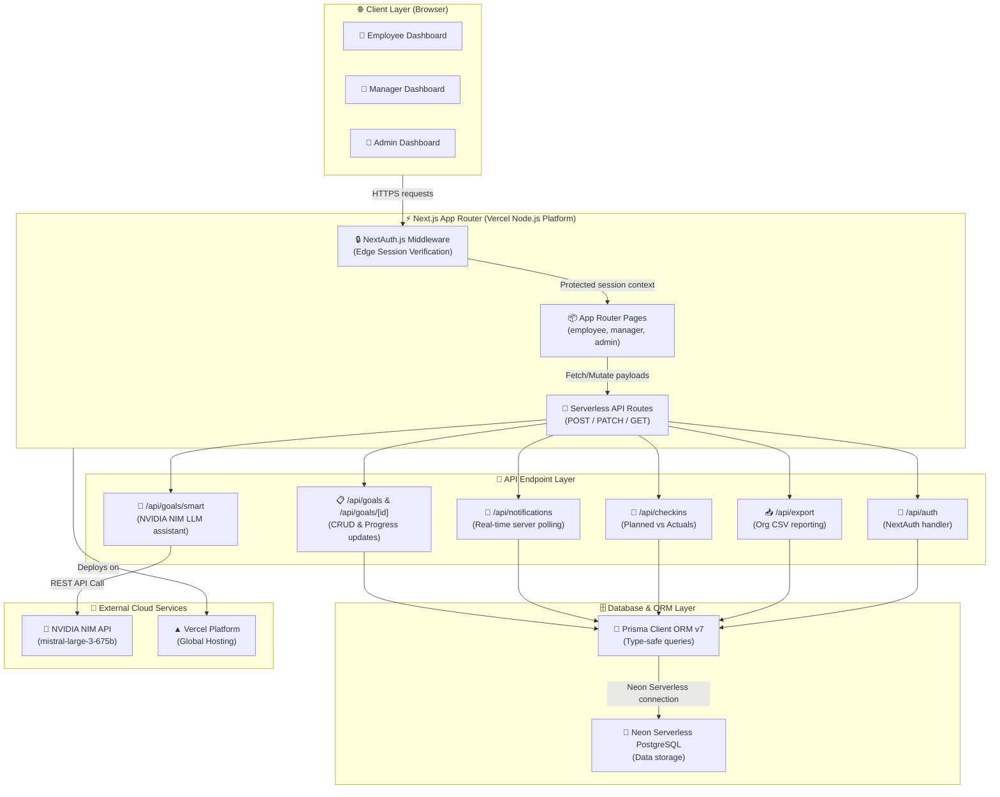
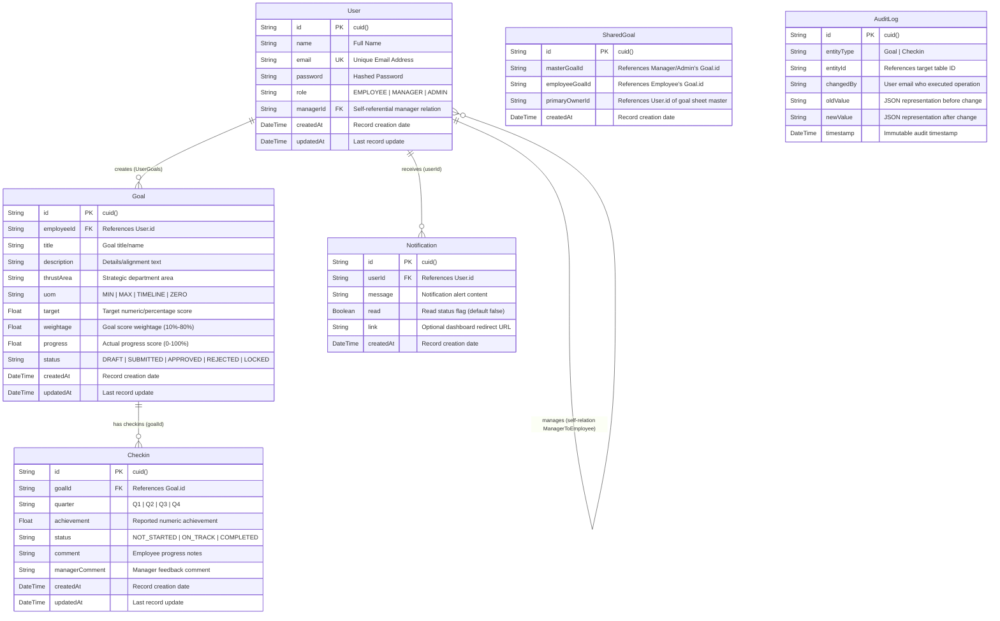
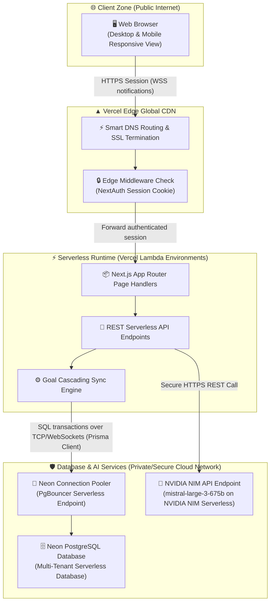
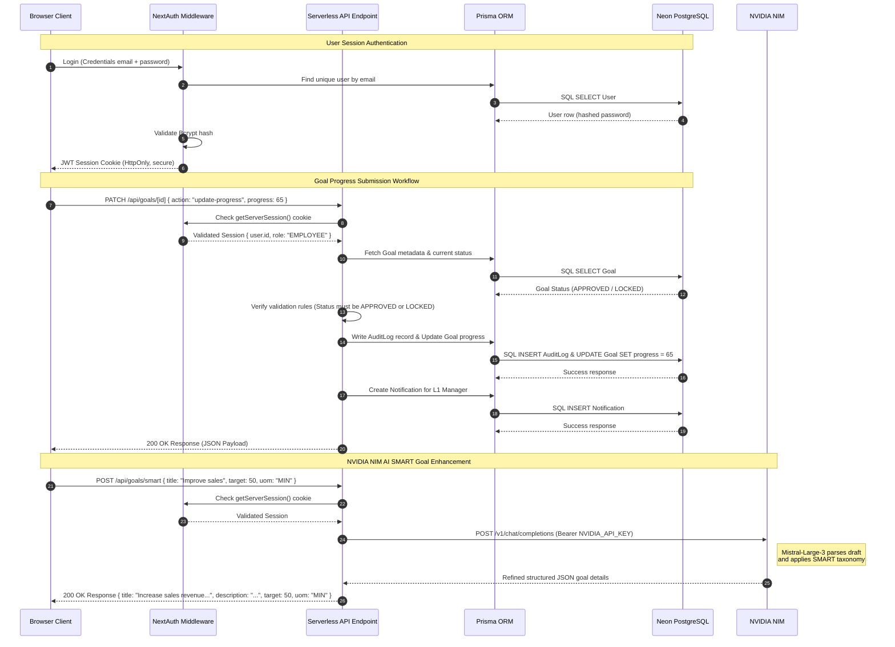
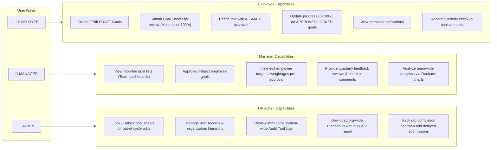
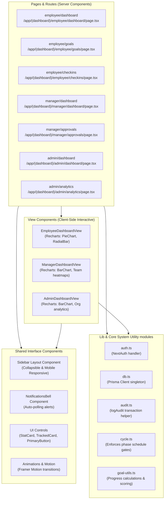
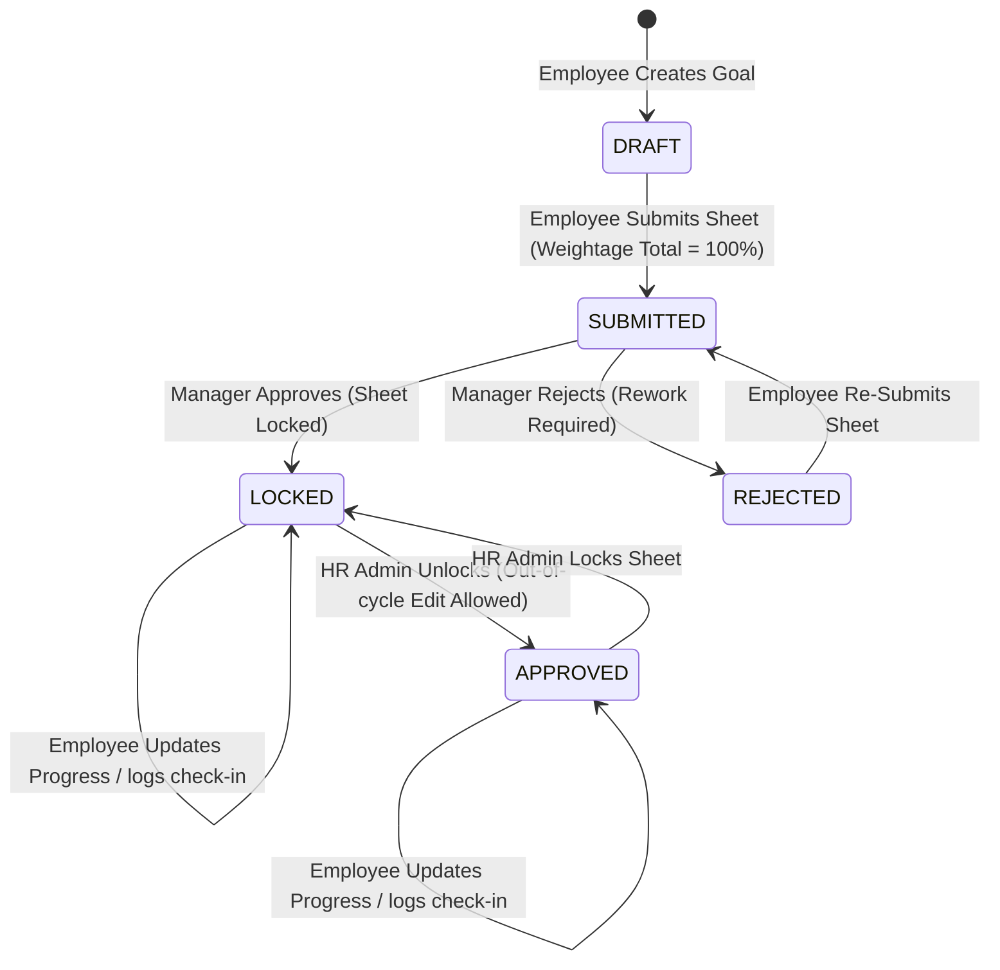

# MYGoals — Enterprise System Architecture & Design

This document details the complete, production-grade system architecture, database models, request lifecycles, and backend synchronization engines powering the **MYGoals** Enterprise Goal Setting & Tracking Portal. These blueprints are tailored to highlight the portal's enterprise capability, strict data validation, and real-time cascaded syncing features.

---

## 🗺️ Table of Contents
1. [Tech Stack Overview](#1-tech-stack-overview)
2. [Database Entity-Relationship Diagram (ERD)](#2-database-entity-relationship-diagram-erd)
3. [Network & Deployment Topology](#3-network--deployment-topology)
4. [Shared Goal Sync Engine Flowchart](#4-shared-goal-sync-engine-flowchart)
5. [Request Flow Lifecycles](#5-request-flow-lifecycles)
6. [Role-Based Access Control (RBAC)](#6-role-based-access-control-rbac)
7. [Component Architecture Map](#7-component-architecture-map)
8. [Goal Lifecycle State Machine](#8-goal-lifecycle-state-machine)

---

## 1. Tech Stack Overview

The Tech Stack Overview illustrates how the client interfaces with the server routing layer, standard API routes, ORM middleware, Neon PostgreSQL database, and NVIDIA NIM LLM.

---

## 2. Database Entity-Relationship Diagram (ERD)

The following diagram maps the structural relationships between each database model declared in the Prisma schema file.

---

## 3. Network & Deployment Topology

The infrastructure schema illustrates the physical hosting configuration, secure database networking, and connection pooler settings of MYGoals on Vercel.

---

## 4. Shared Goal Sync Engine Flowchart

When managers push corporate/departmental KPIs down to reportees, the synchronization engine guarantees read-only target compliance and auto-updates employee achievements in real time whenever the master goal changes.

```mermaid
graph TD
    START(["🟢 Manager Pushes Shared Goal"]) --> DEFINE["Define Master Goal Details<br/>(Title, Thrust Area, Target, UoM)"]
    DEFINE --> SELECT_USERS["Select Target Employees<br/>(Team members / Department list)"]
    SELECT_USERS --> TX_START{"⚡ Start Database Transaction"}

    %% Database Transaction Process
    TX_START --> CREATE_MASTER["1. Create Master Goal Sheet Entry<br/>(Assigned to Primary Owner / Manager)"]
    CREATE_MASTER --> LOOP_USERS["2. Loop Through Selected Employees"]
    
    LOOP_USERS --> CREATE_SUB["3. Create Sub-Goal Sheet Entry<br/>(Title & Target Locked, Status: LOCKED)"]
    CREATE_SUB --> LINK_SHARED["4. Record Link in SharedGoal Table<br/>(Link MasterGoalId to EmployeeGoalId)"]
    
    LINK_SHARED --> ALL_DONE{"All Employees Processed?"}
    ALL_DONE --"No"--> LOOP_USERS
    ALL_DONE --"Yes"--> COMMIT_TX["5. Commit Transaction"]

    %% Propagation Logic
    COMMIT_TX --> SYNC_READY(["🔄 Sync Engine Armed & Listening"])

    %% Achievement Tracking and Propagation Flow
    SYNC_READY --> EMP_UPDATE["👤 Primary Owner logs check-in / updates progress"]
    EMP_UPDATE --> GET_LINKS["🔍 Query SharedGoal records where masterGoalId = updatedGoalId"]
    GET_LINKS --> PROPAGATE_START{"⚡ Cascade Progress Update"}
    
    PROPAGATE_START --> UPDATE_SUB["Update progress & achievement value on all linked Employee Goals"]
    UPDATE_SUB --> CREATE_AUDIT["Write Immutable Audit Logs for all changes"]
    CREATE_AUDIT --> NOTIFY_EMPS["Send Web Notifications to all affected Employees"]
    NOTIFY_EMPS --> DONE(["🏁 Sync Complete & UI Real-Time Updated"])
```

---

## 5. Request Flow Lifecycles

This sequence diagram details the end-to-end network communications and operations triggered during user authentication, goal progress submissions, and AI SMART suggestions.

---

## 6. Role-Based Access Control (RBAC)

MYGoals strictly isolates user capabilities based on roles. A user’s role determines dashboard visualization, write privileges, and data routing paths.

---

## 7. Component Architecture Map

This diagram details the directory organization and the relationship between Server Pages, Client Views, Shared UI layout units, and utility functions in the Next.js framework.

---

## 8. Goal Lifecycle State Machine

Goals migrate strictly across the following state lifecycles to guarantee security and audit readiness. Edits are restricted once a goal advances out of the `DRAFT` state unless unlocked by an Admin.

